# University of Michigan EECS 373: Weight Controlled Labyrinth (Team 12)

## Project Description

The Weight Controlled Labyrinth is an interactive embedded system that allows a user to control a physical maze using their body weight and movement. The system uses a fitness board equipped with four load cells to measure the user's weight distribution and determine their movement, which is then transmitted wirelessly to a microcontroller controlling the labyrinth.

The labyrinth interprets the incoming movement data to control two motors responsible for rotating the maze along its roll and pitch axes. A state machine manages the different stages of gameplay, including tare, ready, movement, and end states. During gameplay, the system calculates the required motor direction and number of steps, dynamically controls motor speed using timers, and tracks the labyrinth's current position.

The goal of the project is to create a physical, responsive labyrinth that translates a user's weight shifting into real-time mechanical movement. The project combines embedded programming, load-cell sensing, wireless communication, motor control, timers, and state-machine design into a single interactive system.

## Table of Contents

1. [Required Software & Hardware](#1-required-software--hardware)  
   1.1. [Software](#11-software)  
   1.1.1. [Software: Non-Mac Users Only](#111-software-non-mac-users-only)  
   1.2. [Hardware](#12-hardware)  
   1.2.1. [Fitness Board Hardware](#121-fitness-board-hardware)  
   1.2.2. [Labyrinth Hardware](#122-labyrinth-hardware)  
   1.2.3. [Hardware System Architecture](#123-hardware-system-architecture)  

2. [Running the Project](#2-running-the-project)  
   2.1. [Flashing the Microcontrollers](#21-flashing-the-microcontrollers)  
   2.2. [Taring the Fitness Board](#22-taring-the-fitness-board)  

3. [Feature List](#3-feature-list)  

4. [How to Play](#4-how-to-play)  

5. [System Architecture](#5-system-architecture)  
   5.1. [High Level System Overview](#51-high-level-system-overview)  
   5.2. [Labyrinth Control Flow](#52-labyrinth-control-flow)  

6. [Frequently Asked Questions (FAQs)](#6-frequently-asked-questions-faqs)  

7. [Repository Structure](#7-repository-structure)  

8. [Acknowledgements](#8-acknowledgements)

# 1. Required Software & Hardware

In order to run this project successfully, there are several highly specific software and hardware requirements that must be met. This section details these requirements.

## 1.1 Software

In order to run, edit, and compile this code you will need to have **STM32CubeIDE 2.0.0** installed. This software can be obtained for free from ST Microcontroller:

[STM32CubeIDE](https://www.st.com/en/development-tools/stm32cubeide.html)

Once at the landing page, click on the **Get Software** button and follow the instructions that come up on your screen.
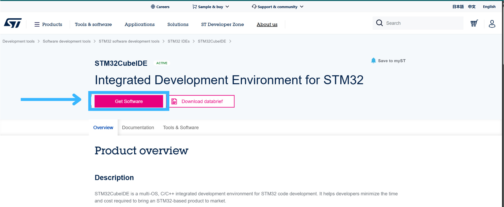

> **NOTE:** If you are a non-Mac user, you will need to install a second software package to launch and edit the configuration of your microcontroller. See [Software: Non-Mac Users Only](#111-software-non-mac-users-only) for more details.

## 1.1.1 Software: Non-Mac Users Only

Due to the way STM32CubeIDE is packaged for non-Mac systems, you will be unable to open, edit, or launch the `.ioc` file that stores the graphical hardware settings for your microcontroller. In order to do so, you must install a second software package, **STM32CubeMX**.

[STM32CubeMX](https://www.st.com/en/development-tools/stm32cubemx.html)

Once at the landing page, click on the **Get Software** button and follow the instructions that come up on your screen.
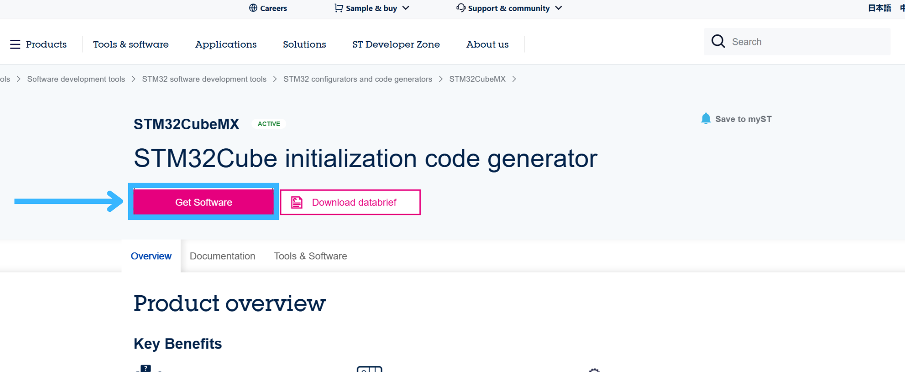

## 1.2 Hardware

This project was run entirely on a custom embedded system architecture, and as such, has many hardware requirements that must be met in order to recreate our exact functionality. This section details the individual components used, as well as information on how to assemble the components together to recreate the final system.

> **NOTE:** This project was housed inside of a Nintendo Wii Fit Board with the original load cells intact. All other Nintendo electronics were removed and replaced. In order to replicate this project as explained here, you will need to use a Nintendo Wii Fit Board or another commercial fitness board with load cells in the feet.

### 1.2.1 Fitness Board Hardware

You will need:

- 4 × 50 kg load cells (Nintendo branding if using a Wii Fit Board)
- 4 × HX711 amplifiers
- 1 × ESP32-C6 with wireless communication capabilities via Wi-Fi
- 1 × STM32F401RE microcontroller

Once all of the hardware is gathered, you will need to solder/connect components together to create the interior of the fitness board.

The required connections are:

- 4 × load cell to amplifier
- 4 × amplifier to microcontroller
- 1 × ESP32-C6 module to microcontroller

For specific information regarding the pins used to connect everything, refer to `FitnessBoard.ioc`.

When finished, the interior of your board should look like this:
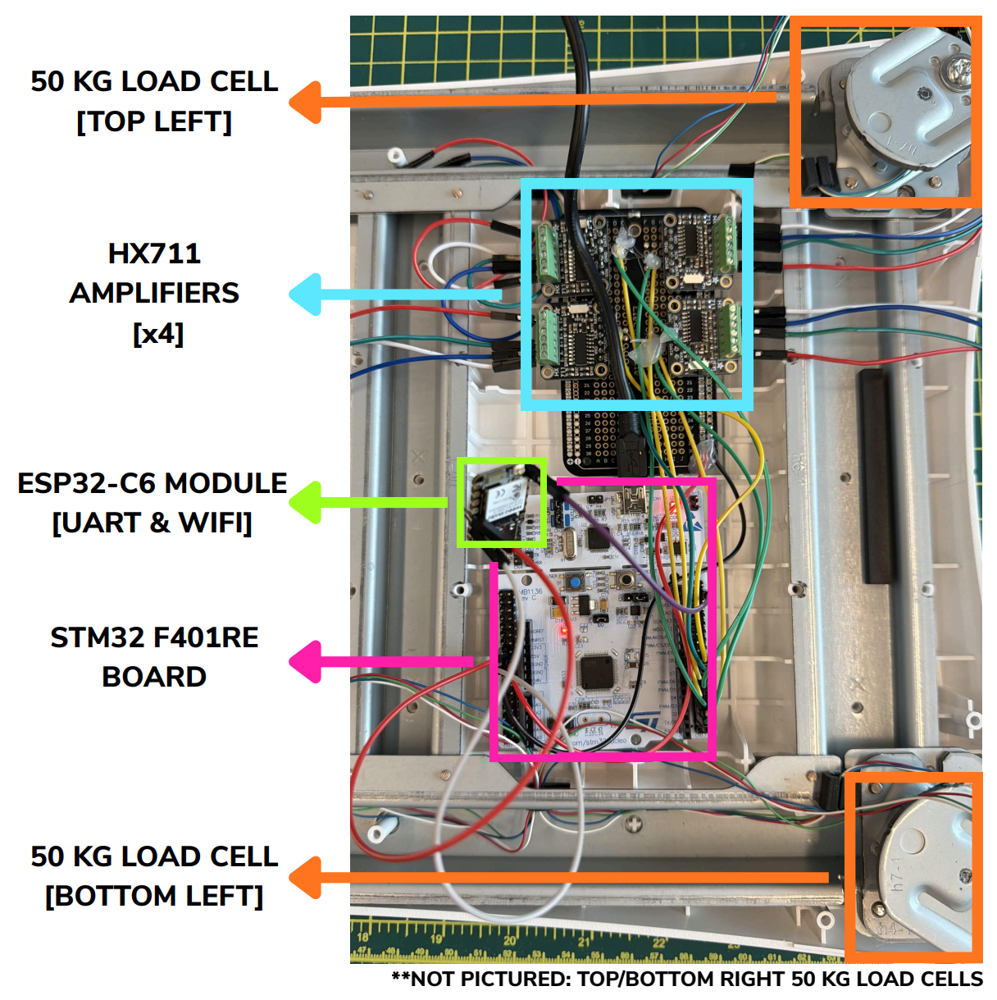

### 1.2.2 Labyrinth Hardware

The maze used for this section of the project can be purchased at the following [link](https://www.ebay.com/itm/177732530189?_skw=wii+fit+balance+board&itmmeta=01KJGSASZXXFDDGD6SJ27SKPQ2&hash=item2961af300d%3Ag%3Aw7IAAeSw%7EZFoSEGw&itmprp=enc%3AAQALAAAA0GfYFPkwiKCW4ZNSs2u11xBz%2FSXgu4khmuCeOoxueXmSgzKVkBHzzLivjBf4%2F1oBXaNBorr5uxXBg9XEKw0ZWKimChFLnQfL%2B9wiy0a4QVBwBkpmWvHMyNyuqe7N8YFBYlp3160c%2BYhalSCD3dyNo0J4gBOBvDy8f1AafMkaljoruLlBBZ2Z%2BBE0tpKdKSwFYURG4zCmqkxCSLQFLairOdMxon5U3C70hC64%2B2fj6kyJf9%2FEWhZm2lvM0m6FtzKbBhiA%2F%2BhzwpOxQ00hT257MCs%3D%7Ctkp%3ABk9SR5Cgq5mUZw&LH_BIN=1).

You will need:

- 2 × stepper motors (200 steps/rev)
- 1 × MAX7219 4×8×8 LED matrix display
- 1 × IR beam break sensor (50 cm)
- 1 × speaker
- 1 × PCM5102A Aux Stereo Digital Audio DAC Decoder
- 1 × ESP32-C6
- 1 × STM32 L4R5ZITXP microcontroller

Once all of the hardware is gathered, you will need to solder/connect components together to interface with the maze.

The required connections are:

- 1 × ESP32-C6 module to microcontroller
- 1 × audio DAC decoder to microcontroller
- 1 × audio DAC decoder to speaker
- 1 × beam break sensor to microcontroller
- 2 × stepper motors to microcontroller
- 1 × LED matrix display to microcontroller

For specific information regarding the pins used to connect everything, refer to `maze_test.ioc`.

When finished, the your labyrinth should look like this:
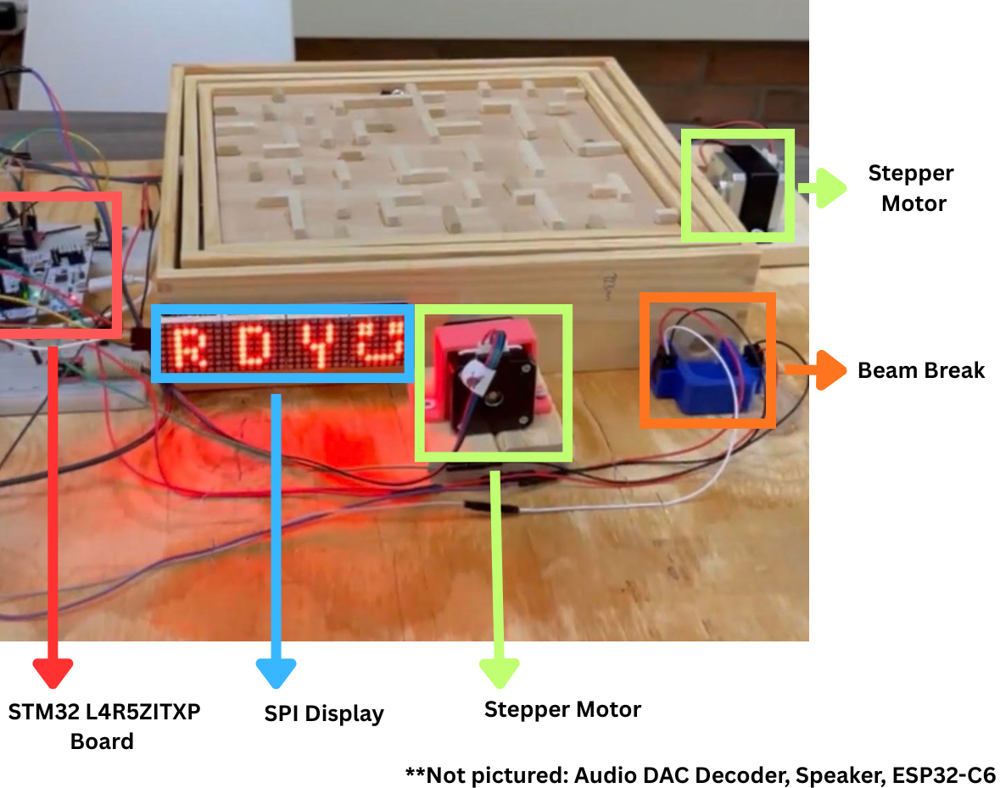

### 1.2.3 Hardware System Architecture

The final hardware system architecure is as follows:
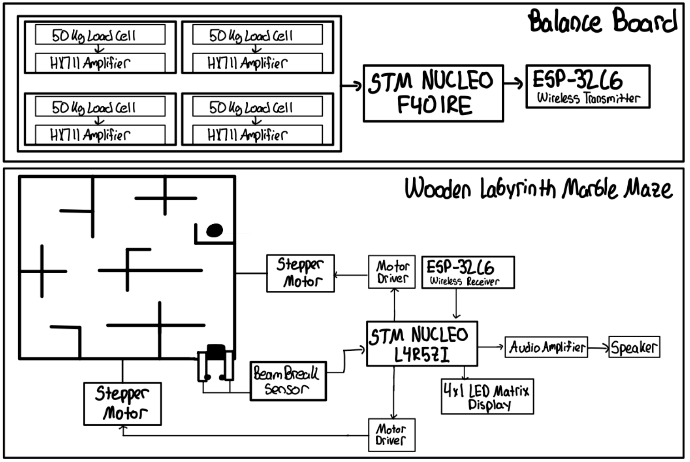

# 2. Running the Project

Once you’ve configured the hardware and have the required software installed, actually running the project can be done in two steps.

## 2.1 Flashing the Microcontrollers

In order to get the code running, it must first be flashed to its respective microcontroller. The process for flashing the microcontroller is identical for both, and as such, will only be demonstrated once.

Use the following steps to flash your microcontroller:

1. Download the Driver folder associated with the microcontroller you’re flashing.
2. Open **STM32CubeIDE**.
3. Click the blue **Create/Import STM32 Project** button.
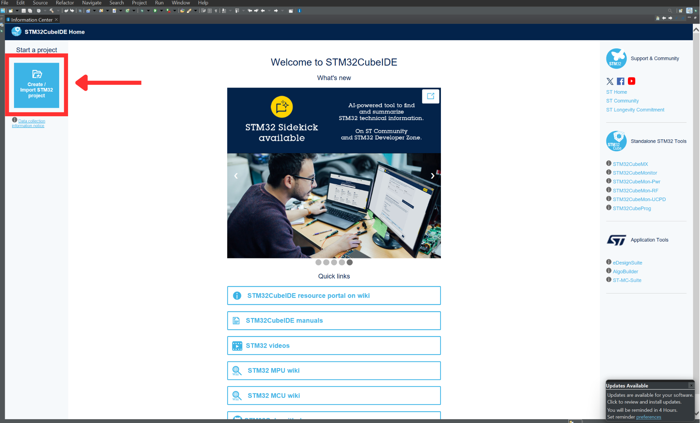
4. Select **STM32CubeMX/STM32CubeIDE Project** from the dropdown.
5. Click **Next**.
6. Select the downloaded file as the import source.
7. Click **Finish**.

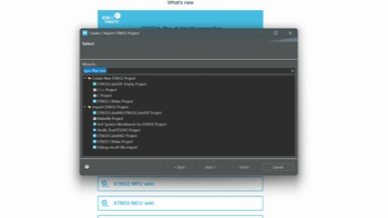

At this point, the project should be open in your application. Once open, do the following:

1. Connect your microcontroller to your device via USB cable.
2. Select **Project** from the menu bar.
3. Select **Build All** from the dropdown.
4. Fix any compile errors that appear on the terminal. If set up correctly, there should be none.
5. Click **Run** from the menu bar.
6. Click **Run As** and select **STM32 [your microcontroller] C/C++ Application**.
7. Disconnect your microcontroller.

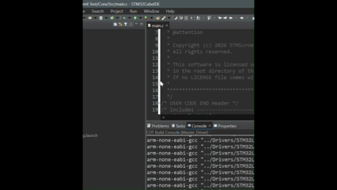

Congratulations, your microcontroller is now flashed! As long as your microcontroller is powered, it will run the code you just flashed to it. For this project, we used a phone charger to power the microcontrollers, but other power options exist.

## 2.2 Taring the Fitness Board

Once you have flashed the fitness board code to your microcontroller, the only thing left to do is to tare the fitness board.

Use the following steps to tare the fitness board:

1. Power on the fitness board and labyrinth.
2. Set the fitness board on the surface on which it will be used.
3. Leave the fitness board powered on for 30 seconds and wait for the maze display to show **"TARE"** before stepping onto the board.
4. Once **"TARE"** is displayed, step onto the board.
5. Wait for the maze display to switch to a timer.
6. Shift your weight slightly to ensure the labyrinth is responsive.
7. Step off the board and ensure **"TARE"** is shown again.
   
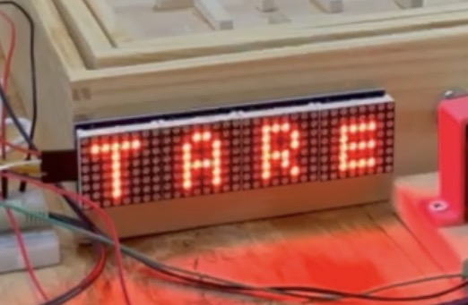

Congratulations, your fitness board and labyrinth are now tared and connected. The system can now be used at will so long as it remains consistently powered. If it loses power, repeat this process before use.

# 3. Feature List

- Center of Mass Tracking
- Wireless Communication Via Wi-Fi
- Timed Gameplay
- Taring Abilities to Reset Between Users
- Automatic Centering/Reset

# 4. How to Play

1. Once [tared](#22-taring-the-fitness-board), slowly step onto the fitness board.
2. Slowly shift your bodyweight to guide the marble to the finishing position.
3. Step off the board, retrieve the marble from the finishing position, and view your time.

# 5. System Architecture

This section serves to highlight how the fitness board and maze interact at a software level, with a specific emphasis placed on the maze side control logic.

## 5.1 High Level Software System Overview

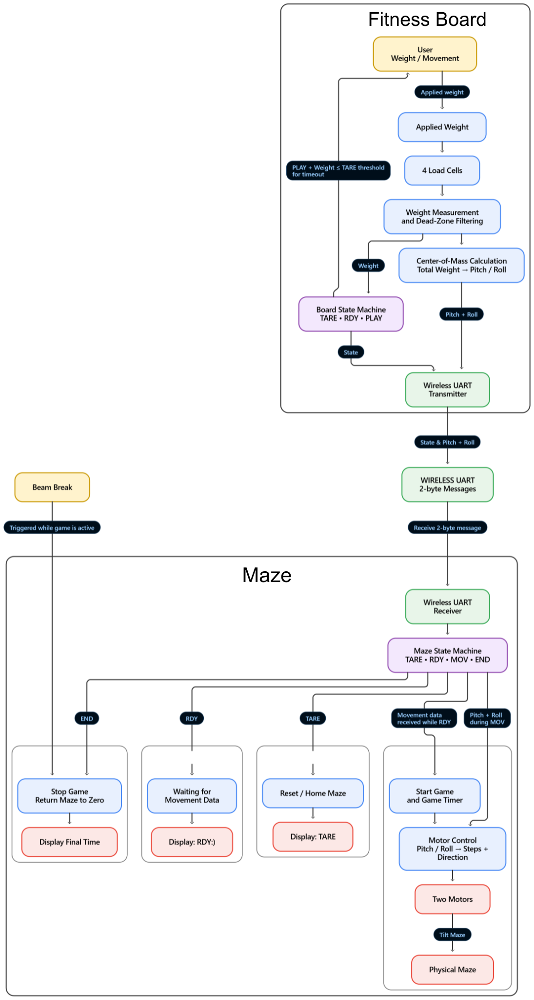

## 5.2 Labyrinth Control Flow

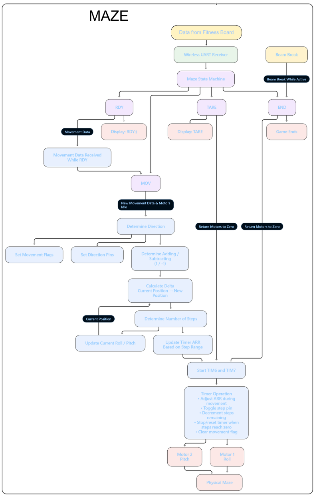

# 6. Frequently Asked Questions (FAQs)

### Can I use the same `.ioc` files with a different microcontroller?

No. In order to use the `.ioc` files included in this repository, you must have the exact same microcontroller as used in this project. The `.ioc` file is specific to the pinout of the specific microcontroller, and as such, must be adjusted to match whatever microcontroller is being used in the project.

### How can I tell if my load cells are working before trying to tare them?

You can modify the `main.c` file associated with the fitness board to print readings locally instead of transmitting them. You can do this using the `printf` function by replacing the line of code that transmits information via UART with a call to `printf` instead. See this [guide](https://community.st.com/stm32-mcus-products-25/how-to-setup-printf-to-print-message-to-console-29347) for best practices regarding `printf` in STM32CubeIDE.

### How can I tell if wireless communication is set up correctly?

You can use the Arduino terminal or `printf` function to view what is being sent across channels. See this [guide](https://www.pleasedontcode.com/blog/debugging-the-esp32-via-wi-fi) for tips and tricks for debugging wireless communication.

### My STM microcontroller won’t flash. What should I do?

If your microcontroller won’t flash, first try swapping out your USB cable. Sometimes the buggy connection is from the cable and isn’t reflective of a problem with the microcontroller itself.

If this doesn’t work, try flashing an empty program with no pins configured. If the failed flash is due to a configuration conflict, wiping the existing configuration completely can fix the issue.

Lastly, if neither of these two fixes work, you might need to replace your microcontroller.

# 7. Repository Structure

```text
.
├── FittnessBoard/
│   ├── src
│   │   ├── main.c              # Main fitness board control loop; reads sensors, computes CoM, wirelessly transmits to maze
│   │   └── hx711.c             # Driver for HX711 load cell amplifiers
│   └── inc
│       ├── main.h
│       └── hx711.h
└── Maze/
    ├── src
    │   ├── main.c              # Maze state machine control logic, manages motor control, timer, and wireless communication
    │   └── MAX7219Driver.c     # Driver for MAX7219 4×8×8 LED matrix display controller
    └── inc
        ├── main.h
        ├── MAX7219Driver.h
        └── audio.h             # Stores the audio files for sound cues for game
```

# 8. Acknowledgements

This project was completed in fulfillment of the final project assignment for **EECS 373 at the University of Michigan** in the W26 semester.

Authors on this project are:

- [Achal Khatri](https://github.com/akkik27)
- [Andrew Leonard](https://github.com/andrewleonard3)
- [Jackson Seifferly](https://github.com/jseifferly)
- [Margaret Wozniak](https://github.com/margwoz)
